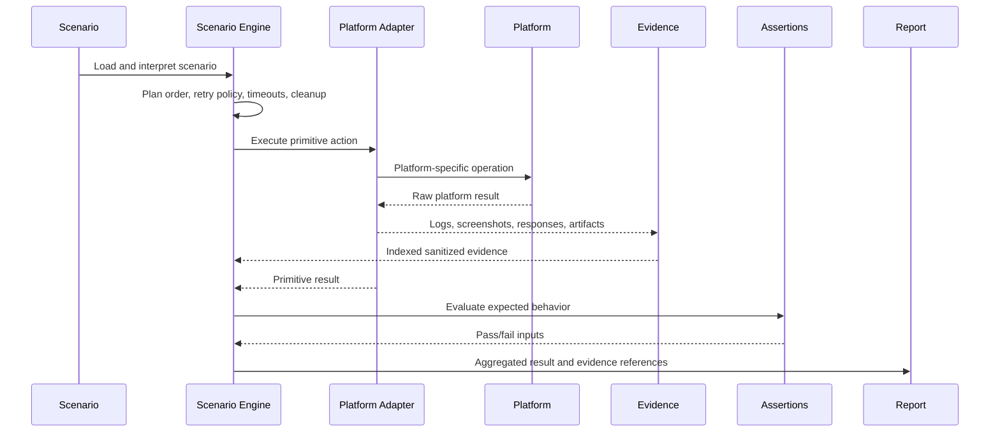

# Verification Core

The Verification Core is the platform-independent execution engine for the
DJConnect Verification Program. It loads and validates scenarios, runs reusable
preflight gates, records environment state, manages evidence and artifacts, and
generates reports. It deliberately contains no Home Assistant, Apple, Windows,
Raspberry Pi, ESP32, Voice Endpoint or product-backend execution logic.

## Refined Architecture

The Verification Core owns all verification logic. Adapters own only
platform-specific execution primitives.

The Scenario Engine is therefore the behavioral center of the framework. It
interprets scenarios, preserves scenario state, determines execution order,
applies retry policy and timeouts, orchestrates evidence, evaluates assertions,
checks expected behavior and decides pass/fail. Future privacy, localization
and performance validation must also live in the core, not in adapters.

Adapters stay intentionally thin. They answer questions like how to launch,
stop, restart, click, type, perform REST or websocket requests, execute a
service, collect logs, capture screenshots, capture serial output and return raw
artifact metadata. They must not decide whether Profile resolution, privacy,
localization, Music DNA, Ask DJ or platform behavior is correct.

## Module Layout

- `tools/verification/models/`: shared dataclasses and enums.
- `tools/verification/scenario/`: scenario loading, schema validation, scheduling and Scenario Engine.
- `tools/verification/configuration/`: config, environment variable and secret-name loading.
- `tools/verification/hygiene/`: repository hygiene gates.
- `tools/verification/build/`: build qualification metadata checks.
- `tools/verification/environment/`: host, git, locale and toolchain snapshots.
- `tools/verification/evidence/`: evidence storage, redaction, checksums and indexes.
- `tools/verification/artifacts/`: run artifact directory management and cleanup.
- `tools/verification/reporting/`: Markdown, JSON and JUnit report generation.
- `tools/verification/execution/`: scenario execution shell and result aggregation.
- `tools/verification/core/`: reusable orchestration pipeline.
- `tools/verification/cli.py`: command line interface.

Compatibility wrappers remain in the previous flat modules so existing imports
continue to work while the core grows.

## Execution Pipeline

1. Load configuration from defaults, optional ignored local config, environment
   variables and CLI overrides.
2. Load scenario YAML/JSON files from configured scenario paths.
3. Validate the accepted scenario schema and deterministic scenario IDs.
4. Schedule scenarios by ID, tag or component.
5. Run repository hygiene and build qualification gates.
6. Capture an environment snapshot with timestamp, host, OS, architecture,
   generic toolchain, locale, timezone, git SHA, git branch, dependency metadata
   and configuration fingerprint.
7. Interpret scenario steps, assertions, expected results, evidence
   requirements, cleanup policy, retry policy and timeouts in the Scenario
   Engine.
8. Delegate only primitive platform actions to a registered adapter when
   adapters exist.
9. Collect evidence, checksums and indexes.
10. Evaluate assertions and expected behavior in the Scenario Engine.
11. Aggregate results and generate Markdown, JSON or JUnit reports.

Phase 5 intentionally stops before platform adapters. Scenario execution returns
`SKIPPED` until a future adapter is registered.

## Scenario Engine

`tools.verification.scenario.ScenarioEngine` owns verification behavior:

- scenario interpretation;
- scenario state and execution order;
- expected behavior;
- assertions;
- evidence requirements;
- cleanup policy;
- retry policy;
- timeout handling;
- pass/fail determination;
- result aggregation inputs.

Phase 5A keeps execution adapter-skipped, but the ownership boundary is now
explicit: adapters may produce primitive results and evidence, while the Scenario
Engine decides what those results mean.

## Adapter API

Future adapters implement `tools.verification.adapters.VerificationAdapter`.
The required lifecycle is:

- `initialize()`
- `shutdown()`
- `health()`
- `prepare_environment()`
- `launch(target=None)`
- `stop()`
- `restart()`
- `click(target, **kwargs)`
- `type(text, **kwargs)`
- `execute_service(name, payload=None)`
- `execute_rest(method, path, payload=None, headers=None)`
- `execute_websocket(message)`
- `execute_action(action)`
- `cleanup()`
- `collect_logs()`
- `collect_artifacts()`
- `capture_screenshot(name=None)`
- `capture_serial()`
- `collect_environment()`
- `collect_artifact_metadata()`
- `reset()`

The core knows only this primitive execution contract. Adapters own
platform-specific mechanics, protocol calls, UI automation, device
communication, log retrieval and artifact capture. They do not own assertions,
expected behavior, privacy checks, localization checks, performance checks or
pass/fail decisions.

## Sequence

## Repository Hygiene

The reusable hygiene pipeline checks working tree state, branch state, dependency
manifest presence, generic toolchain availability, cleanup targets and a git
environment fingerprint. Open PR validation is a platform-neutral extension
point and is skipped until a provider is configured.

Cleanup gates support dry-run behavior. The CLI `verification clean` previews
evidence cleanup by default and only removes files with `--apply`.

## Build Qualification

Build qualification is metadata-first. The core records artifact path, version,
checksum, signing metadata, entitlements, configuration, CI metadata,
release-equivalent status and instrumented status. It does not run build
commands; adapters or CI integrations provide raw artifact metadata. The core
qualifies that metadata.

## Evidence And Reports

Evidence supports logs, screenshots, requests, responses, serial logs, artifacts,
reports, environment snapshots and checksums. Text evidence is redacted for
secret-bearing terms before storage.

Reports are trend-ready:

- Markdown includes summary, failure index, readiness and history placeholder.
- JSON includes structured readiness, scenario results, evidence references and
  history metadata.
- JUnit XML maps scenario results to test cases for CI surfaces.

## CLI

Supported commands:

- `verification doctor`
- `verification validate`
- `verification list`
- `verification report --format markdown|json|junit`
- `verification clean [--apply]`
- `verification env`
- `verification schema`
- `verification config`
- `verification dry-run`
- `verification execute`

The CLI supports `--dry-run`; scenario execution remains adapter-skipped in this
phase.

## Future Extension Points

Phase 6 can add the first Home Assistant adapter by implementing the adapter
interface and registering it with `AdapterRegistry`. Later adapters should reuse
the same scenario loader, gates, evidence model, artifact manager and reporting
pipeline without adding platform assumptions to the core.

## Phase 5A Review Report

- `models`: Correct after small refactor. Added primitive action/result and
  scenario execution plan models so the core can represent behavior without
  adapter pass/fail logic.
- `scenario`: Needed small refactor. Added `ScenarioEngine` to own scenario
  interpretation, assertions, expected results, evidence requirements, cleanup,
  retry policy and timeouts.
- `execution`: Needed small refactor. `ScenarioExecutor` now delegates behavior
  to `ScenarioEngine` instead of directly constructing scenario outcomes.
- `adapters`: Needed architectural change. Removed the adapter-shaped
  `execute_step(...)->ScenarioResult` and renamed build qualification to raw
  artifact metadata collection. The API now exposes primitive platform actions.
- `core`: Correct. It remains the orchestration layer for gates, snapshots,
  scenario execution and aggregation.
- `configuration`: Correct. It loads config and secret names without
  verification behavior.
- `hygiene`: Correct. Repository hygiene remains core-owned.
- `build`: Correct. Qualification remains core-owned and consumes metadata.
- `environment`: Correct. Snapshot collection is platform-independent.
- `evidence` and `artifacts`: Correct. Evidence orchestration and storage remain
  core-owned.
- `reporting`: Correct. Report generation and readiness remain core-owned.
- `cli`: Correct. It exposes core commands and does not execute platform logic.
