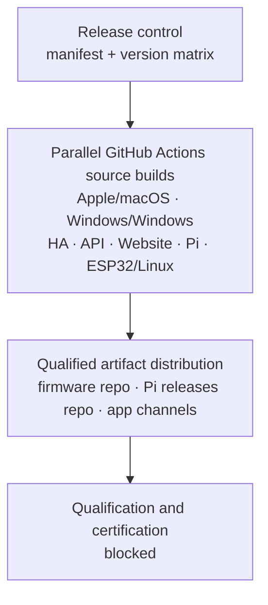

# Platform Release 3.3 — Discovered Dependency Graph

The nodes are an execution snapshot derived dynamically from Repository
Ownership. The mandatory repositories are:

- `pcvantol/djconnect`, `pcvantol/djconnect-api`,
  `pcvantol/djconnect-app`, `pcvantol/djconnect-windows`,
  `pcvantol/djconnect-pi`, `pcvantol/djconnect-esp32`, and
  `pcvantol/djconnect-website`.
- `pcvantol/djconnect-firmware` and `pcvantol/djconnect-pi-releases`
  participate as distribution surfaces. `pcvantol/djconnect-app-releases` is
  an internal unsigned Apple artifact-handoff surface; it is not a public
  distribution node for an `INTERNAL_RELEASE`.

The source stage can run concurrently after release control. Apple and Windows
use qualified self-hosted native runners; all other source builds use
GitHub-hosted Linux. Distribution is ordered after source qualification. Pi and
ESP32 are artifact-consuming deployment targets, never source-build nodes. No
future/optional repository was invented or excluded by name.
