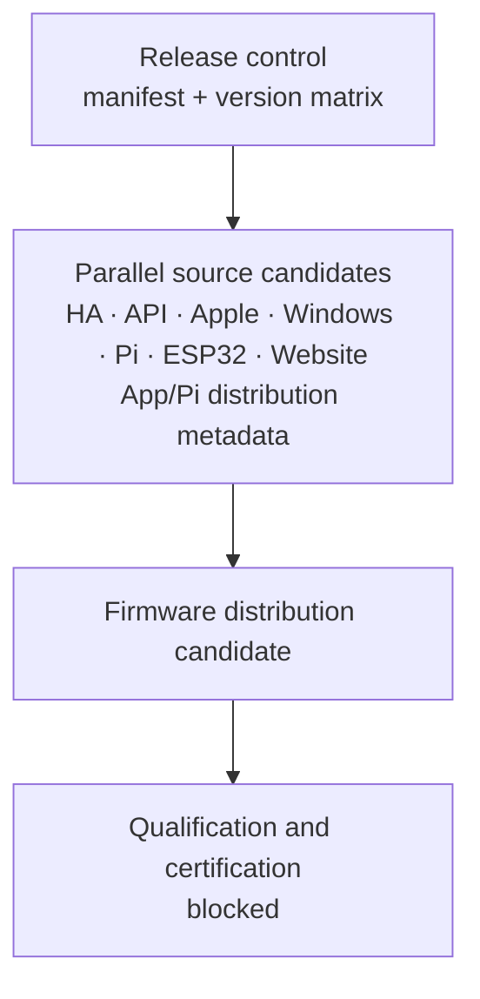

# Platform Release 3.3 — Discovered Dependency Graph

The nodes are an execution snapshot derived dynamically from Repository
Ownership. The mandatory repositories are:

- `pcvantol/djconnect`, `pcvantol/djconnect-api`,
  `pcvantol/djconnect-app`, `pcvantol/djconnect-windows`,
  `pcvantol/djconnect-pi`, `pcvantol/djconnect-esp32`, and
  `pcvantol/djconnect-website`.
- `pcvantol/djconnect-firmware`, `pcvantol/djconnect-app-releases`, and
  `pcvantol/djconnect-pi-releases` participate as distribution surfaces.

The source stage can run concurrently after release control. Distribution is
ordered after source qualification. No future/optional repository was
invented or excluded by name.
