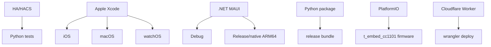

# Build Variants

The machine-readable inventory is
[`inventory/build_variants.json`](inventory/build_variants.json).

## Observed Build Systems

`CONFIRMED_CODE` HA is a HACS custom integration tested with Python tests.

`CONFIRMED_CODE` ESP32 uses PlatformIO environment `t_embed_cc1101` and native
C++/Python tests.

`CONFIRMED_CODE` Windows uses .NET MAUI solution/project files, Debug/Release
configurations and CI release workflows.

`CONFIRMED_CODE` Pi uses Python package/tests and updater/release bundle
scripts.

`CONFIRMED_CODE` API uses Cloudflare Workers, wrangler, TypeScript and tests.

`CONFIRMED_CODE` Apple uses Xcode/Swift source, iOS/macOS/watchOS targets and
UI/contract fixtures.

## Authoritative Builds

`DOCUMENTED_ONLY` Windows native ARM64 on Windows is the authoritative
Windows-specific target per verification docs.

`DOCUMENTED_ONLY` ESP32 authoritative firmware target is LilyGO T-Embed
CC1101/ESP32-S3 with PlatformIO env `t_embed_cc1101`.

`UNKNOWN` Exact current TestFlight/App Store signing/export matrix for Apple
was not reconstructed.

## Verification Mapping

`RELEASE-*`, `LOCALIZATION-*`, `ESP-*`, `PI-*`, `APPLE-*`, `WINDOWS-*`.
