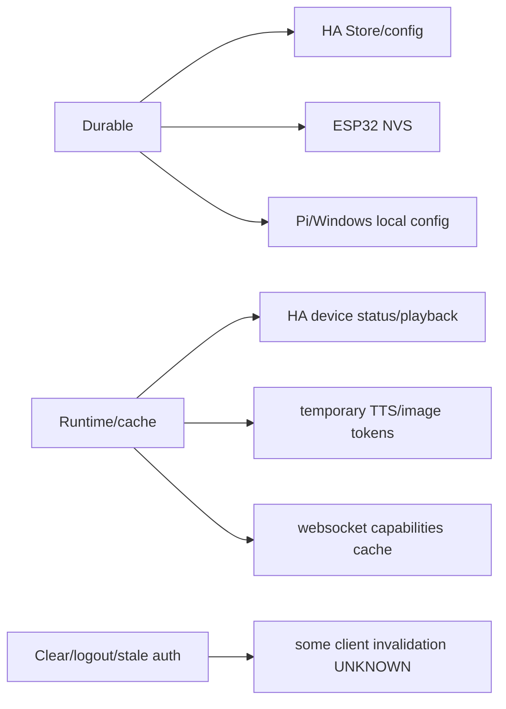

# Cache Model

## What Survives Restart

`CONFIRMED_CODE` HA `Store` data survives restart for profile platform state,
Ask DJ history and Music DNA. Config entry data/options survive restart for
pairing/config/OAuth fields.

`CONFIRMED_CODE` Windows Credential Manager/Keychain token storage survives app
restart. Preferences/app data survive app restart.

`CONFIRMED_CODE` Pi config files and updater status survive restart.

`CONFIRMED_CODE` ESP32 NVS survives reboot and power loss.

## What Is Session/Runtime

`CONFIRMED_CODE` HA runtime holds mutable device status, last playback, last
voice/debug state, temporary TTS audio cache and local push status summaries.
Temporary TTS/image proxy tokens are runtime/cache-like and not durable profile
state.

`CONFIRMED_CODE` Apple websocket capabilities are cached for 60 seconds in the
fast-path actor.

`CONFIRMED_CODE` Pi/Windows websocket capabilities are cached enough to gate
fast-path calls; exact expiry differs by client implementation.

## Profile vs Device vs Session

`CONFIRMED_CODE` Current HA implementation has profile-owned stores for Music
DNA/history plus device/client mapping state. Clients should treat local chat
or display caches as reconstructable from HA unless explicitly demo/local mode.

`UNKNOWN` Complete per-client cache invalidation on profile switch/logout was
not exhaustively proven for Apple, Windows or Pi.

## Verification Mapping

`ASKDJ-018..020`, `MUSICDNA-006`, `PROFILE-*`, `PRIVACY-*`, `SETUP-019`,
`SETUP-020`.
