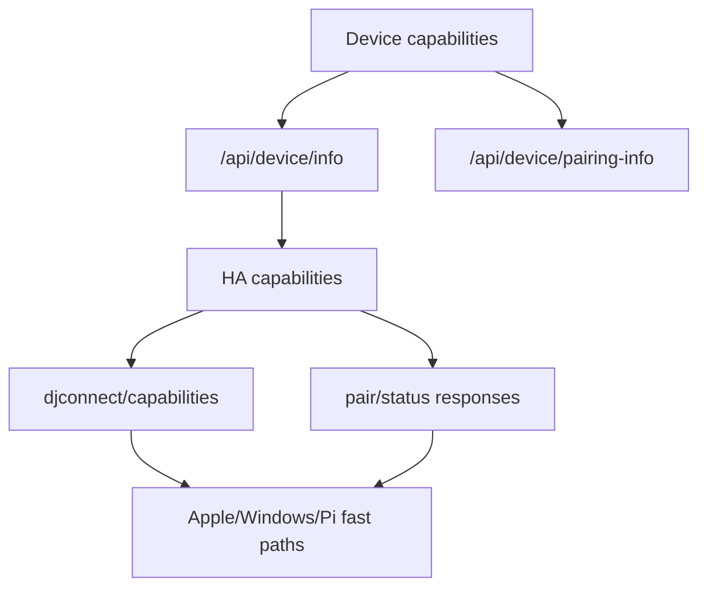

# Capability Discovery

## Mechanisms

`CONFIRMED_CODE` HA status and pairing responses include Ask DJ, backend,
announcement, push and URL metadata. Device status payloads include client
capabilities.

`CONFIRMED_CODE` HA websocket `djconnect/capabilities` advertises commands,
features, fallbacks and contract versions.

`CONFIRMED_CODE` ESP32 and Pi local `/api/device/info` and
`/api/device/pairing-info` responses include `capabilities` and `client_type`.

## Capability Examples

`CONFIRMED_CODE` ESP32 advertises profile platform/request-context/private
session support but no profile CRUD/selection on local info/pairing responses.

`CONFIRMED_CODE` Websocket features include Ask DJ chat/history/idle suggestion,
backend commands, Track Insight, Music DNA and Music Discovery.

`CONFIRMED_CODE` Music backend capabilities are included in HA responses and
parsed by ESP32, Pi and Windows.

## Future Expansion Points

`DOCUMENTED_ONLY` Foundation and Baseline documents expect capability discovery
to prevent client-version inference. The current code already exposes capability
objects, but this pass did not prove every client consumes every advertised
field.

## Verification Mapping

`SETUP-002`, `CAPABILITY-001..008`, `BACKEND-*`, `PROFILE-*`.
