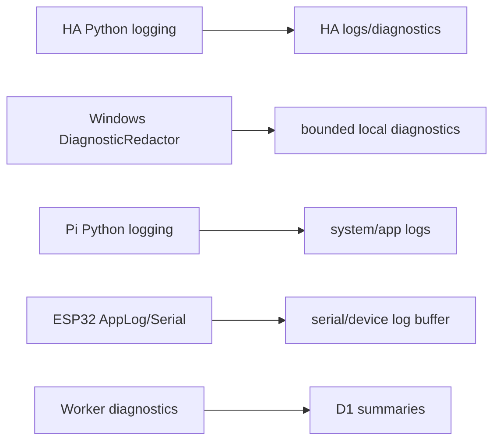

# Client Logging

The machine-readable inventory is
[`inventory/client_logging.json`](inventory/client_logging.json).

## HA

`CONFIRMED_CODE` HA uses Python `logging.getLogger(__name__)`, redacts debug
payloads and avoids raw prompt/audio/token logging in observed route code.
Diagnostics redaction is implemented for sensitive key names.

## Apple

`CONFIRMED_CODE` Apple source uses Swift logging/diagnostic paths and has UI
surfaces for logs/diagnostics. Full persistence/rotation details were not fully
reconstructed.

## Windows

`CONFIRMED_CODE` Windows contains `DiagnosticRedactor`, bounded diagnostic log
preference tests and security tests that redact authorization, bearer/device
tokens, pairing codes, bootstrap proofs, HA tokens, push tokens, secrets and
private URLs.

## Pi

`CONFIRMED_CODE` Pi uses Python `logging`. Client API and HA transport log
device/client metadata and avoid token values in the observed snippets.

## ESP32

`CONFIRMED_CODE` ESP32 uses `AppLog` and `Serial`. It logs operational events
and explicitly logs token presence rather than token values in pairing storage.

## Central API

`CONFIRMED_CODE` Cloudflare Worker logs only structured `unhandled_error` on
unexpected exceptions in the main fetch handler and records route/status/error
diagnostics in D1.

## Verification Mapping

`PRIVACY-*`, `LOCALIZATION-*`, `NETWORK-*`, `RELEASE-*`.
