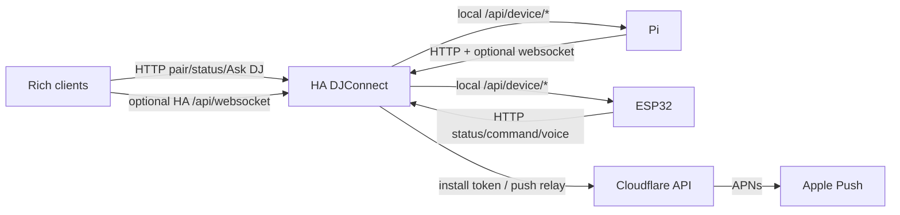

# Client / Server Transport

## HTTP

`CONFIRMED_CODE` HTTP is the canonical transport for pairing, status, command,
voice, Ask DJ, Music DNA, Music Discovery, Track Insight, VibeCast, image proxy,
TTS audio and push registration/bootstrap/unregister.

`CONFIRMED_CODE` ESP32 and Pi use plain local HTTP for `/api/device/*`.
Post-pairing local device calls require bearer authorization.

## WebSocket

`CONFIRMED_CODE` HA registers DJConnect commands on Home Assistant's native
`/api/websocket`. The `djconnect/capabilities` command advertises supported
commands, feature groups, HTTP fallbacks, contract versions and transports.

`CONFIRMED_CODE` Apple, Windows and Pi implement websocket fast paths and fall
back to HTTP if unavailable, missing, disabled or unauthorized.

## Audio URL Transport

`CONFIRMED_CODE` HA can generate temporary `/api/djconnect/v1/tts/{token}.{ext}`
URLs for WAV/MP3 TTS audio. HA posts `text` plus optional `audio_url` to ESP32
`/api/device/dj_response`.

## Polling / Realtime

`CONFIRMED_CODE` ESP32 and Pi periodically post status to HA. Rich clients use
explicit refresh/status calls and optional websocket command fast paths. The
active Runtime additionally exposes one authenticated, Runtime-scoped Broadcast
subscription with an initial snapshot and incremental events; its current
implementation contract is
[`BROADCAST_TRANSPORT.md`](BROADCAST_TRANSPORT.md).

## Verification Mapping

`CAPABILITY-*`, `NETWORK-*`, `ASKDJ-*`, `MUSICDNA-*`, `VOICE-*`, `PLAYBACK-*`.
