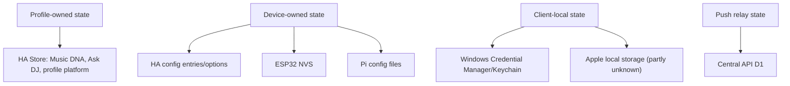

# Client Storage

The machine-readable inventory is
[`inventory/client_storage.json`](inventory/client_storage.json).

## HA

`CONFIRMED_CODE` HA uses Home Assistant `Store` for profile platform storage,
Ask DJ history and Music DNA. Config entries/options hold pairing, OAuth and
runtime configuration. Runtime objects cache device status, playback and push
status.

## Apple

`CONFIRMED_CODE` Apple source references UserDefaults/Keychain-style storage
and keeps local UI/cache state. Exact key list and rotation behavior remain
`UNKNOWN` for this pass.

## Windows

`CONFIRMED_CODE` Windows stores bearer tokens in Windows Credential Manager or
macOS Keychain through `CredentialStore.cs`. It uses MAUI Preferences and app
data files for non-secret local state/log/export surfaces.

## Pi

`CONFIRMED_CODE` Pi persists configuration including HA URL, device token,
pairing code, paired state, update channel and backend capability summary in
local config/state files. The updater uses `/opt/djconnect` style release/config
paths by default.

## ESP32

`CONFIRMED_CODE` ESP32 persists provisioning, HA URL, bearer token, language,
display, theme/log-level and wake-word settings through ESP `Preferences`/NVS.

## Central API

`CONFIRMED_CODE` Central API stores install tokens, bootstrap proofs, APNs
registrations, audit events and diagnostics in Cloudflare D1. APNs tokens are
hashed and encrypted when the encryption key is available.

## Verification Mapping

`PROFILE-*`, `MUSICDNA-*`, `ASKDJ-*`, `PRIVACY-*`, `EXPORT-*`, `IMPORT-*`,
`SETUP-019`, `SETUP-020`.
