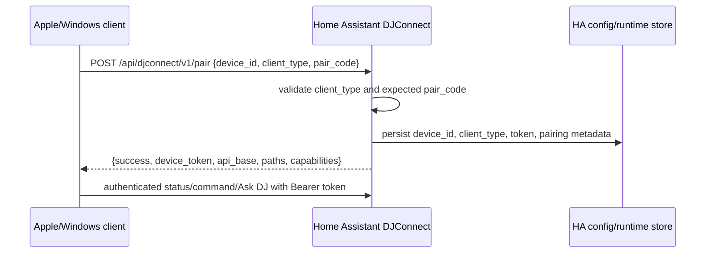
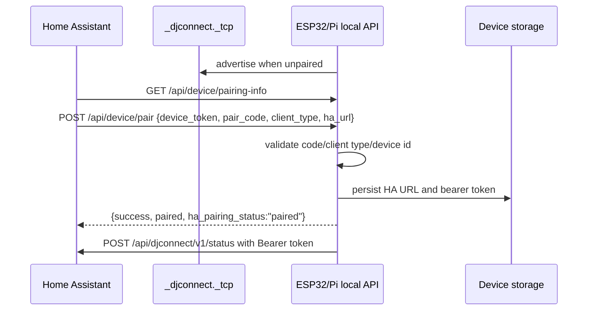

# Pairing

## Why Multiple Pairing Flows Exist

`INFERRED` Pairing differs because the platform has both local devices that
host their own device API (ESP32, Pi) and rich clients that only call Home
Assistant outbound (Apple, Windows). The current implementation supports both
families and preserves legacy/compatibility field aliases.

## Flow A: App Client Pairs To Home Assistant

Applies to Apple and Windows.

`CONFIRMED_CODE` HA exposes `POST /api/djconnect/v1/pair` with
`requires_auth = False`. The handler validates JSON, `device_id`, `pair_code`,
required `client_type`, expected runtime client type and expected pair code.
On success it issues/persists a per-device token and returns API metadata.

`CONFIRMED_TEST` Windows tests assert pairing posts only to
`/api/djconnect/v1/pair`, sends `client_type:"windows"`, sends `pair_code`,
`pairing_token` and `pairing_code`, uses no bearer token before pairing, and
does not call `/api/device/*`.

`CONFIRMED_CODE` Apple source contains QR/manual pairing UI and sends client
identity through HTTP/websocket payloads. Detailed final pairing persistence
fields are not fully reconstructed in this pass.

## Flow B: HA Pairs To Local Device API

Applies to ESP32 and Pi.

`CONFIRMED_CODE` ESP32 exposes `GET /api/device/pairing-info` and
`POST /api/device/pair`. Pair requests require `client_type:"esp32"`,
`device_token`, HA URL and matching pair code, then store pairing in NVS through
device/provisioning code.

`CONFIRMED_CODE` Pi exposes the same local endpoints in `client_api.py`.
Pi validates pair code, `client_type:"raspberry_pi"`, optional device-id match,
stores `device_token`, HA URL, paired state, and ignores `ha_remote_url` because
Pi transport is local-only.

`CONFIRMED_CODE` HA runtime calls local `/api/device/pairing-info` and
`/api/device/pair`, and uses bearer-authenticated `/api/device/command`,
`/api/device/ota`, `/api/device/info`, reboot/forget endpoints.

## Flow C: Device-Initiated HA Pair

`CONFIRMED_CODE` ESP32 `DJConnectPairing.cpp` posts directly to
`/api/djconnect/v1/pair` with `device_id`, `device_name`, `client_type`,
`pair_code`, `firmware` and local URL, then stores returned `device_token` and
HA local URL.

`CONFIRMED_CODE` Pi `ha.py` has a `pair(pair_code)` method that posts to HA
`/api/djconnect/v1/pair`, stores returned token and marks itself paired.

## Trust Model

`CONFIRMED_CODE` Initial pairing is code-based and unauthenticated at the HA
HTTP layer. Post-pairing calls use `Authorization: Bearer <device_token>` plus
device/client identity. Local device API post-pairing endpoints validate the
same bearer token.

`CONFIRMED_CODE` Wrong pair code returns structured errors such as
`invalid_pair_code`; wrong client type returns `invalid_client_type` or
`client_type_mismatch`; stale/unauthorized authenticated calls return
`unauthorized`, `stale_pairing` or related policy errors depending on client
and route.

## Recovery

`CONFIRMED_CODE` HA options include repair/re-pair paths. ESP32 and Pi expose
local forget/reboot/restart APIs. Windows has policy that treats selected 401,
403 and stale-pairing errors as requiring local cleanup.

## Verification Mapping

`SETUP-013`, `SETUP-014`, `SETUP-015`, `SETUP-019`, `SETUP-021`,
`SETUP-022`, `NETWORK-001..008`, `ESP-*`, `PI-*`, `APPLE-*`, `WINDOWS-*`.
