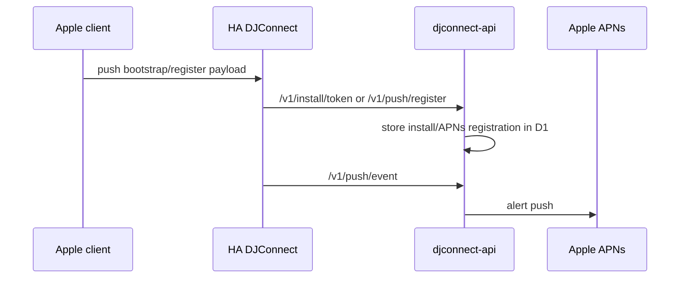

# Push Notifications

## Apple Push Flow

`CONFIRMED_CODE` HA has `push.py` and HTTP routes:

- `POST /api/djconnect/v1/push/bootstrap`
- `POST /api/djconnect/v1/push/register`
- `POST /api/djconnect/v1/push/unregister`

`CONFIRMED_CODE` HA forwards registration/unregistration/events to the central
API using install tokens when available. It redacts push tokens in logs and
persists push status, not raw APNs tokens.

`CONFIRMED_CODE` Central API exposes install-token/bootstrap-proof routes and
push register/unregister/event routes. APNs registrations are stored in D1 with
token hash and encrypted token fields. Push delivery uses APNs sandbox or
production endpoint based on environment.

## Non-Apple Clients

`CONFIRMED_CODE` HA `push.py` supports Apple client types only. Windows tests
explicitly check no Apple/APNs push bootstrap flow is introduced.

## Unknowns

`UNKNOWN` Actual Apple entitlements/background mode configuration was not fully
verified in this pass.

## Verification Mapping

`APPLE-*`, `PRIVACY-*`, `NETWORK-*`, `RELEASE-*`.
