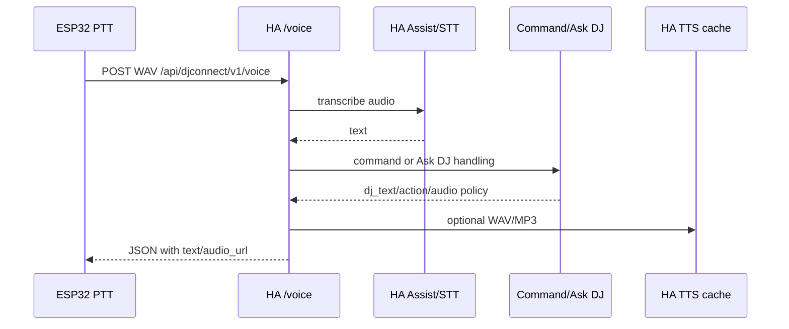

# Voice Transport

## ESP32 PTT

`CONFIRMED_CODE` ESP32 records WAV through `VoiceRecorder` and uploads to HA
`POST /api/djconnect/v1/voice` using `Content-Type: audio/wav`,
`Authorization: Bearer <device_token>` and `X-DJConnect-Device-ID`.

`CONFIRMED_CODE` HA limits WAV size, stores a debug last-voice WAV in runtime
debug state, transcribes through Home Assistant Assist/STT helpers and then
runs the recognized text through command playback logic for ESP audio requests.

## App Ask DJ Voice

`CONFIRMED_CODE` HA treats audio uploads from Ask DJ voice-capable app client
types as Ask DJ input after STT. Response includes `transcript` and
`recognized_text`, plus Ask DJ result fields and optional audio.

## Text/JSON Voice Route

`CONFIRMED_CODE` Non-audio JSON/text requests to `/voice` are treated as DJ
response tests and do not run playback command parsing.

## DJ Response Audio

`CONFIRMED_CODE` HA generates temporary TTS audio URLs where possible and posts
DJ responses to ESP32 `/api/device/dj_response`. ESP32 can play WAV/MP3 streams
and otherwise displays text.

## Verification Mapping

`VOICE-001..008`, `ESP-*`, `APPLE-*`, `ASKDJ-*`, `PLAYBACK-*`.
